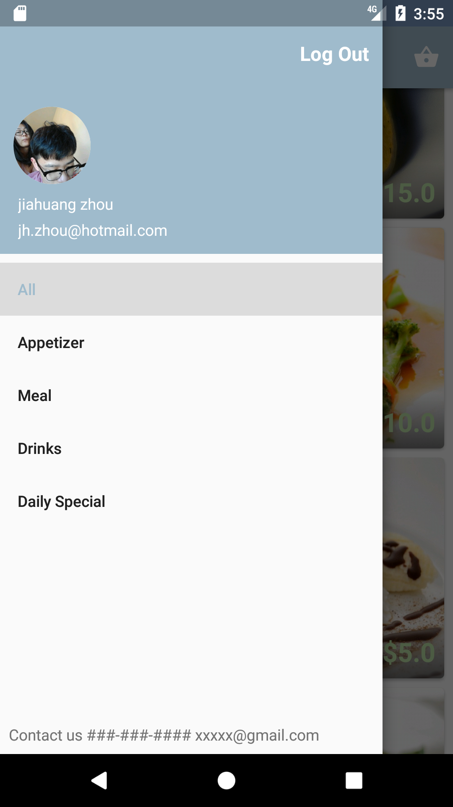
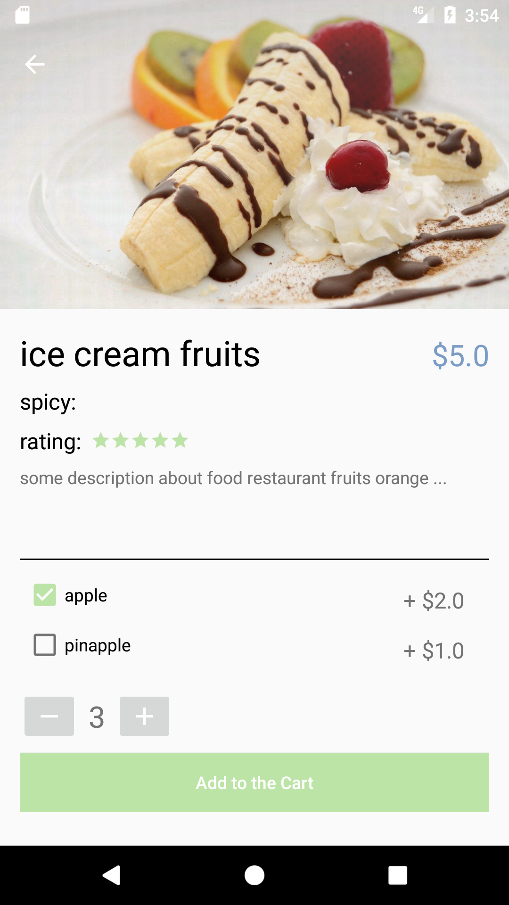
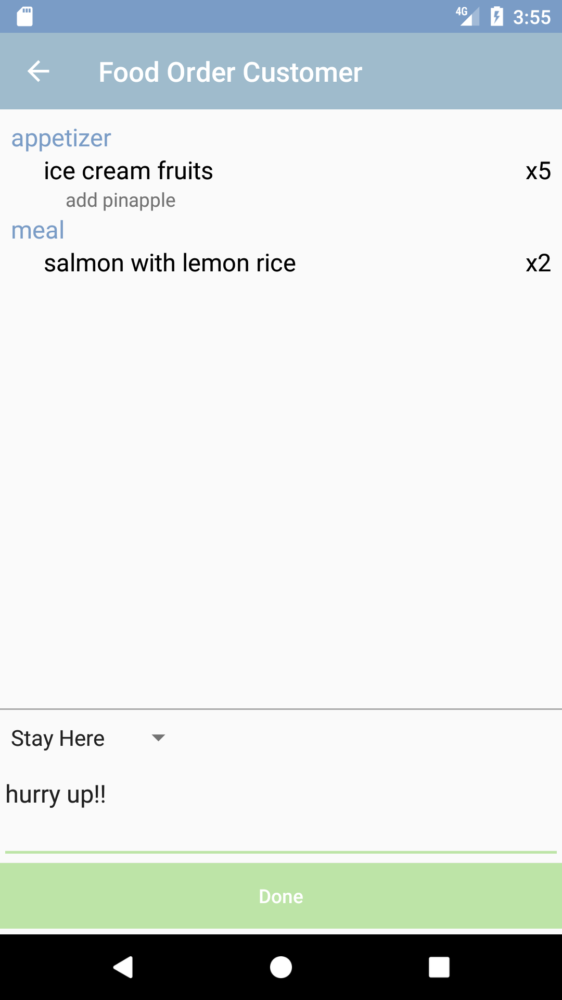
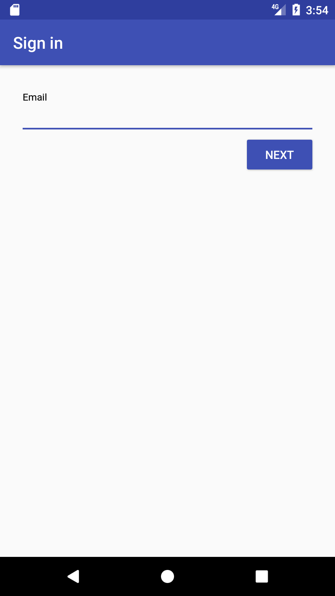
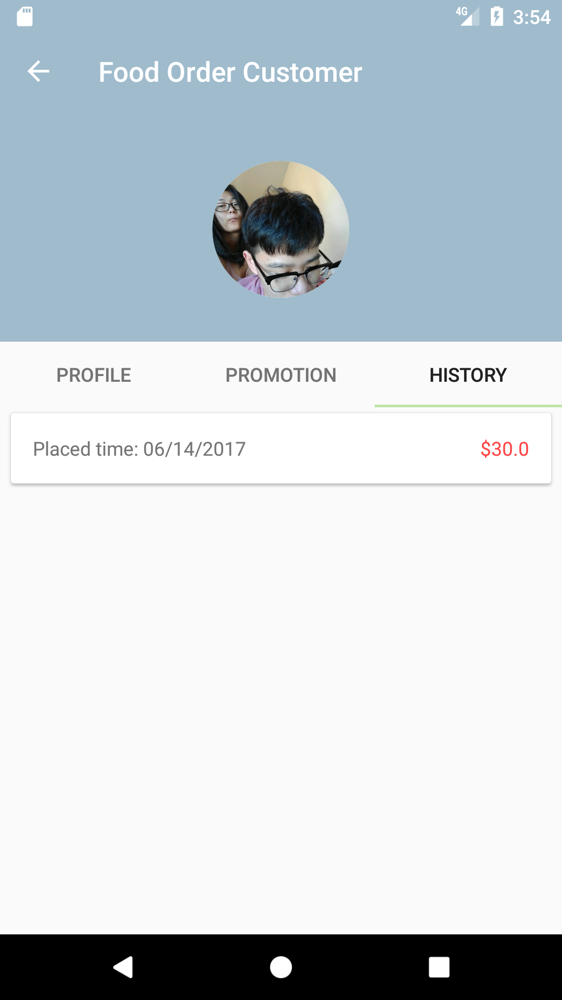

# Food_Order_App
* Combined Firebase Realtime Database, Cloud Storage and Authentication
* display user avatar in a circle imageview

## Pre-requisites
* Android SDK v25
* Android Build Tools v25.0.2
* Android Support Repository v25.3.1

## Getting Started
This sample uses the Gradle build system. To build this project, use the "gradlew build" command or use "Import Project" in Android Studio.

### Built With
* [Butterknife](http://jakewharton.github.io/butterknife/) - Field and method binding for Android views
* [CircleImageView](https://github.com/hdodenhof/CircleImageView) - A circular ImageView
* [Firebase](https://firebase.google.com/) Tools from Google for developing great apps, engaging with your users, and earning more through mobile ads.
* [Glide](https://github.com/bumptech/glide) - An image loading and caching library

## ScreenShot
     

## Author
[Jiahuang Zhou](http://github.com/jzhou23)

## Support 
* Google+ Community: https://plus.google.com/communities/105153134372062985968
* Stack Overflow: http://stackoverflow.com/questions/tagged/android

## License
Copyright 2016 The Android Open Source Project, Inc.

Licensed to the Apache Software Foundation (ASF) under one or more contributor license agreements. See the NOTICE file distributed with this work for additional information regarding copyright ownership. The ASF licenses this file to you under the Apache License, Version 2.0 (the "License"); you may not use this file except in compliance with the License. You may obtain a copy of the License at

http://www.apache.org/licenses/LICENSE-2.0

Unless required by applicable law or agreed to in writing, software distributed under the License is distributed on an "AS IS" BASIS, WITHOUT WARRANTIES OR CONDITIONS OF ANY KIND, either express or implied. See the License for the specific language governing permissions and limitations under the License.
